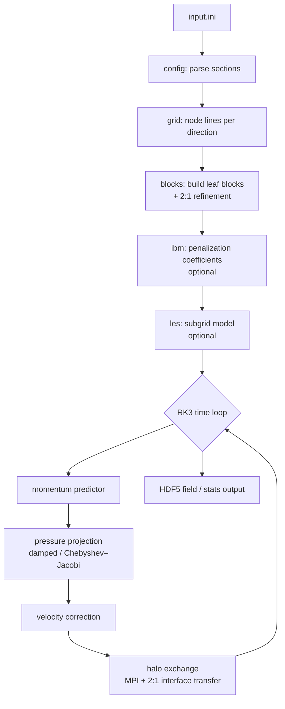

<p align="center">
  
</p>

# mobydiff

**A simple and (reasonably) efficient solver for the incompressible Navier–Stokes equations.**


`mobydiff` integrates the incompressible Navier–Stokes equations with second-order
finite differences on a staggered Cartesian grid, an explicit low-storage RK3 time
integrator, and a segregated pressure-projection step. It supports per-direction grid
stretching, block-structured **2:1 local refinement**, a volume-penalization **immersed
boundary method** (IBM) for arbitrary STL geometries, and optional **large-eddy
simulation** (LES). It runs distributed on CPUs (MPI) and offloads to NVIDIA GPUs
(OpenMP target offload).

---

## Governing equations

`mobydiff` solves the incompressible Navier–Stokes equations for a Newtonian fluid,

```math
\frac{\partial \mathbf{u}}{\partial t} + (\mathbf{u}\cdot\nabla)\,\mathbf{u} = -\nabla p + \frac{1}{\mathrm{Re}}\,\nabla^2 \mathbf{u} + \mathbf{f}, \qquad \nabla\cdot\mathbf{u} = 0,
```

where $\mathbf{u}$ is the velocity, $p$ the pressure (divided by density), $\mathrm{Re}$
the Reynolds number, and $\mathbf{f}$ an optional body force (constant forcing and/or a
spatially varying field). The incompressibility constraint is enforced at every stage by
a pressure projection that solves a variable-coefficient Poisson problem

```math
\nabla^2 \phi = \frac{1}{\Delta t}\,\nabla\cdot\mathbf{u}^{\ast}, \qquad \mathbf{u}^{n+1} = \mathbf{u}^{\ast} - \Delta t\,\nabla \phi .
```

Immersed solid bodies are imposed with volume penalization: a per-cell coefficient field
drives the velocity to zero inside the body via an implicit source term, so no explicit
time-step restriction is introduced by the geometry.

See [`docs/numerical-methods.md`](docs/numerical-methods.md) for the full discretization.

---

## Features

- **Staggered second-order finite differences** on a Cartesian grid, uniform or stretched
  independently per direction (uniform / natural near-wall / custom node lines).
- **Explicit low-storage RK3** advancement with CFL- and Péclet-limited adaptive `dt`.
- **Segregated pressure projection** by a **damped-Jacobi** smoother with optional
  **Chebyshev–Jacobi** acceleration — SPD and consistent across grid stretching and
  refinement interfaces.
- **Block-structured grid with 2:1 local refinement** (BCM-style equal-size blocks): box-
  or geometry-driven refinement, removal of blocks buried inside solid bodies, and
  conservative 2:1 interface transfer.
- **Immersed boundary method** (volume penalization) for arbitrary watertight STL
  geometries, with a Python preprocessor (`mobygeom`) that reuses the solver's exact grid.
- **Large-eddy simulation** (WALE subgrid model), validated across refinement interfaces
  and IBM walls.
- **Distributed + GPU**: 3D MPI Cartesian decomposition with 26-neighbour halo exchange,
  and OpenMP target offload for NVIDIA GPUs from a single source.

---

## Dependencies

- CMake ≥ 3.20
- A Fortran + C compiler:
  - **CPU** reference build: `gcc`/`gfortran` ≥ 13
  - **GPU** build: NVIDIA HPC SDK (NVHPC) with CUDA 12+
- Parallel (MPI-enabled) HDF5 ≥ 1.14
- An MPI stack (GPU builds need a GPU-aware MPI)
- Python 3 with `numpy`, `h5py`, `matplotlib` (for the preprocessing and analysis tools)

---

## Build

The build is driven by `compile.sh`, which selects the CPU or GPU toolchain:

```bash
./compile.sh cpu     # → build_cpu/main  (reference build; gfortran)
./compile.sh gpu     # → build_gpu/main  (NVIDIA GPU offload; NVHPC)
```

Build both when you want the CPU path as a debugging reference. For the GPU build, load
the NVHPC toolchain first, e.g.:

```bash
module load /opt/nvidia/hpc_sdk/modulefiles/nvhpc-hpcx-cuda13/26.3
./compile.sh gpu
```

If CMake cannot locate HDF5, point it at your parallel build:
`HDF5_ROOT=/path/to/parallel-hdf5 ./compile.sh cpu`.

The build also produces `mobygrid`, a serial grid/preprocessing tool used to export the
exact node coordinates for IBM coefficient generation.

---

## Quick start

Run any case through `mpirun`, even on a single rank:

```bash
mpirun -n 1 ./build_gpu/main tutorials/min_channel/input_gpu.ini
```

This runs a minimal turbulent channel with a 2:1 wall-band refinement, writing HDF5 field
snapshots you can inspect with the tools in `tools/`. A larger, publication-scale channel
and an external-aerodynamics IBM case are documented in
[the tutorials guide](docs/tutorials.md).

```bash
# distributed CPU run over 8 ranks
mpirun -n 8 ./build_cpu/main tutorials/channel_kmm180/input.ini
```

---

## Documentation

| Page | Contents |
|------|----------|
| [Installation](docs/installation.md) | Toolchains, HDF5, CPU vs GPU builds, troubleshooting |
| [Running the solver](docs/running.md) | The run workflow, MPI decomposition, output, restart |
| [Configuration reference](docs/configuration.md) | Every `.ini` section and key |
| [Numerical methods](docs/numerical-methods.md) | Discretization, projection, refinement, IBM, LES |
| [Tutorials](docs/tutorials.md) | `channel_kmm180` (turbulent channel) and `sailplane` (IBM) |
| [Tools reference](docs/tools.md) | Geometry preprocessing, verification, post-processing |
| [Validation & verification](docs/validation.md) | Test flows and how correctness is checked |
| [Developer guide](docs/developer-guide.md) | Source layout, data model, GPU model, conventions |

The full documentation index is in [`docs/index.md`](docs/index.md).

---

## Architecture at a glance



---

## License

`mobydiff` is released under the **GNU General Public License v3.0**. See [`LICENSE`](LICENSE).
