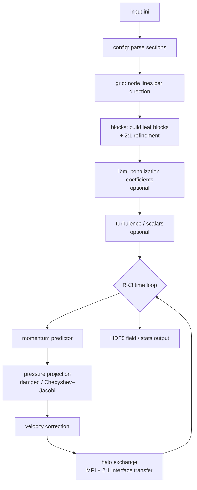

<p align="center">
  
</p>

# mobydiff

**A simple and (reasonably) efficient solver for the incompressible Navier–Stokes equations.**


`mobydiff` integrates the incompressible Navier–Stokes equations with second-order
finite differences on a staggered Cartesian grid, an explicit low-storage RK3 time
integrator, and a segregated pressure-projection step. It supports per-direction grid
stretching, block-structured **2:1 local refinement**, a volume-penalization **immersed
boundary method** (IBM) for arbitrary STL geometries, optional **LES**, **RANS**
(k-ω SST, transition, wall functions) and **IDDES**, and **passive scalars** with
conjugate heat transfer. It runs distributed on CPUs (MPI) and offloads to NVIDIA GPUs
(OpenMP target offload).

---

## Governing equations

`mobydiff` solves the incompressible Navier–Stokes equations for a Newtonian fluid,

```math
\frac{\partial \mathbf{u}}{\partial t} + (\mathbf{u}\cdot\nabla)\,\mathbf{u} = -\nabla p + \frac{1}{\mathrm{Re}}\,\nabla^2 \mathbf{u} + \mathbf{f}, \qquad \nabla\cdot\mathbf{u} = 0,
```

where $\mathbf{u}$ is the velocity, $p$ the pressure (divided by density), $\mathrm{Re}$
the Reynolds number, and $\mathbf{f}$ an optional body force (constant forcing and/or a
spatially varying field). The incompressibility constraint is enforced at every stage by
a pressure projection that solves a variable-coefficient Poisson problem

```math
\nabla^2 \phi = \frac{1}{\Delta t}\,\nabla\cdot\mathbf{u}^{\ast}, \qquad \mathbf{u}^{n+1} = \mathbf{u}^{\ast} - \Delta t\,\nabla \phi .
```

Immersed solid bodies are imposed with volume penalization: a per-cell coefficient field
drives the velocity to zero inside the body via an implicit source term, so no explicit
time-step restriction is introduced by the geometry.

See [`docs/numerical-methods.md`](docs/numerical-methods.md) for the full discretization.

---

## Features

- **Staggered second-order finite differences** on a Cartesian grid, uniform or stretched
  independently per direction (uniform / natural near-wall / custom node lines).
- **Skew-symmetric (energy-conserving) convection** and **explicit low-storage RK3** advancement with CFL- and Péclet-limited adaptive `dt`.
- **Segregated pressure projection** by a **damped-Jacobi** smoother with optional
  **Chebyshev–Jacobi** acceleration — SPD and consistent across grid stretching and
  refinement interfaces (red-black SOR remains selectable).
- **Block-structured grid with 2:1 local refinement** (BCM-style equal-size blocks): box-
  or geometry-driven refinement, removal of blocks buried inside solid bodies, and
  conservative 2:1 interface transfer.
- **Immersed boundary method** (volume penalization) for arbitrary watertight STL
  geometries or analytic walls, preprocessed by the MPI-parallel `moby_prepare`, which
  reuses the solver's own grid and classification kernels.
- **Turbulence models**: LES (Smagorinsky / WALE), k-ω SST RANS (γ–Re_θt transition, wall
  functions) and SST-IDDES, validated across refinement interfaces and IBM walls.
- **Passive scalars** (any number, each with its own Pr/Sc) with Dirichlet, adiabatic or
  **conjugate** (solid conduction) treatment at the immersed interface.
- **Flow cases**: generic, channel, spatially developing boundary layer (Blasius inlet +
  trip), and airfoil (inlet/outlet faces, control-volume C_L/C_D).
- **Distributed + GPU**: 3D MPI Cartesian decomposition with 26-neighbour halo exchange,
  and OpenMP target offload for NVIDIA GPUs from a single source.

---

## Dependencies

- CMake ≥ 3.20
- A Fortran + C compiler:
  - **CPU** reference build: `gcc`/`gfortran` ≥ 13
  - **GPU** build: NVIDIA HPC SDK (NVHPC) with CUDA 12+
- Parallel (MPI-enabled) HDF5 ≥ 1.14
- An MPI stack (GPU builds need a GPU-aware MPI)
- Python 3 with `numpy`, `h5py`, `matplotlib` (for the preprocessing and analysis tools)

---

## Build

The build is driven by `compile.sh`, which selects the CPU or GPU toolchain:

```bash
./compile.sh cpu     # → build_cpu/{moby_solve,moby_prepare}  (reference build)
./compile.sh gpu     # → build_gpu/{moby_solve,moby_prepare}  (NVIDIA GPU offload; NVHPC)
```

Build both when you want the CPU path as a debugging reference. For the GPU build, load
the NVHPC toolchain first, e.g.:

```bash
module load /opt/nvidia/hpc_sdk/modulefiles/nvhpc-hpcx-cuda13/26.3
./compile.sh gpu
```

If CMake cannot locate HDF5, point it at your parallel build:
`HDF5_ROOT=/path/to/parallel-hdf5 ./compile.sh cpu`.

Each build directory holds two executables: `moby_solve` (the solver; `main` is a
compatibility symlink to it) and `moby_prepare` (the MPI-parallel preprocessor that writes
the block-table case file for IBM runs — see [Running](docs/running.md)).

---

## Quick start

Run any case through `mpirun`, even on a single rank:

```bash
mpirun -n 1 ./build_gpu/moby_solve tutorials/min_channel/input_gpu.ini
```

This runs a minimal turbulent channel with a 2:1 wall-band refinement, writing HDF5 field
snapshots you can inspect with the tools in `tools/`. The other tutorials (turbulent
channel, boundary layer, airfoil RANS, conjugate heat transfer, IBM sailplane) are listed in
[the tutorials guide](docs/tutorials.md).

```bash
# distributed CPU run over 8 ranks
mpirun -n 8 ./build_cpu/moby_solve tutorials/channel_kmm180/input.ini
```

---

## Documentation

| Page | Contents |
|------|----------|
| [Installation](docs/installation.md) | Toolchains, HDF5, CPU vs GPU builds, troubleshooting |
| [Running the solver](docs/running.md) | The run workflow, MPI decomposition, output, restart |
| [Configuration reference](docs/configuration.md) | Every `.ini` section and key |
| [Numerical methods](docs/numerical-methods.md) | Discretization, projection, refinement, IBM, turbulence, scalars |
| [Tutorials](docs/tutorials.md) | The shipped cases in `tutorials/` |
| [Tools reference](docs/tools.md) | Geometry helpers, verification, post-processing |
| [Validation & verification](docs/validation.md) | Test flows and how correctness is checked |
| [Developer guide](docs/developer-guide.md) | Source layout, data model, GPU model, conventions |

The full documentation index is in [`docs/index.md`](docs/index.md).

---

## Architecture at a glance


```mermaid
flowchart TD
    A[input.ini] --> B[config: parse sections]
    B --> C[grid: node lines per direction]
    C --> D[blocks: build leaf blocks<br/>+ 2:1 refinement]
    D --> E[ibm: penalization coefficients<br/>optional]
    E --> F[turbulence / scalars<br/>optional]
    F --> G{RK3 time loop}
    G --> H[momentum predictor]
    H --> I[pressure projection<br/>damped / Chebyshev–Jacobi]
    I --> J[velocity correction]
    J --> K[halo exchange<br/>MPI + 2:1 interface transfer]
    K --> G
    G --> L[HDF5 field / stats output]
```

---

## License

`mobydiff` is released under the **GNU General Public License v3.0**. See [`LICENSE`](LICENSE).
