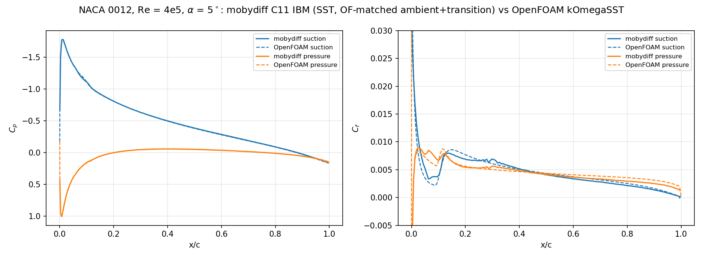

# NACA 0012 RANS validation — alpha = 5 deg, Re_c = 4e5, vs OpenFOAM

Steady k-omega SST flow over a NACA 0012 at 5 degrees incidence and
chord Reynolds number 4e5, computed with mobydiff's volume-penalization
IBM on a 2:1-refined block grid, and validated against a body-fitted
OpenFOAM (simpleFoam, kOmegaSST) reference. Every modelling choice that
matters is MATCHED between the codes:

- identical closed-TE NACA 0012 geometry (their NACA0012.obj agrees
  with our analytic section to 7e-8);
- identical SST coefficients (their run's printed dict, incl. the
  c1 = 10 production limiter and the nut clip; see
  assets/openfoam/RAS_coefficients_as_run.txt);
- ambient turbulence WITHOUT sustain (their decayControl false), inlet
  k/omega = their inlet pair (tu 21.35 %, nut_in = 1.09 nu);
- forced transition reproducing their fvOptions: k pinned to zero for
  x < LE + 0.09c and volumetric k trip strips at x/c 0.10-0.12 on both
  surfaces ([rans] kpin_box / ktrip_box in c11_aoa5.ini);
- skew-symmetric momentum convection (mobydiff's production form).

Grid: 128c x 96c domain, nose at (50, 48), span y (0.1875c, ny 8),
xz-quadtree refinement, projection niter 18 (Chebyshev-Jacobi). Two
configurations are documented:

- PRODUCTION (`c11_aoa5_nose.ini`): 12 levels with the body band capped
  at 11 and a level-12 band on the NOSE alone (`refine_body_levels` +
  `refine_body_box`), finest c/12288 there. First-cell y+ 2.3 at the LE,
  1.4-2.1 over the rest of the chord. 16976 leaves / 8.69M cells,
  dt = 2.5e-5, converged at t = 35.
- BASELINE (`c11_aoa5.ini`): level 11 everywhere, finest c/6144, y+ 4.6
  at the LE and 1.4-2.1 elsewhere. 16042 leaves / 8.2M cells, dt = 5e-5,
  converged at t = 30. Kept as the "before" of the nose-refinement
  comparison below.

## Results (converged)

|               | production | baseline | OpenFOAM (body-fitted) |
|---------------|------------|----------|------------------------|
| C_L           | 0.520 +- 0.005 | 0.514 +- 0.009 | 0.5142      |
| C_D           | 0.0128 +- 0.0008 | 0.0130 +- 0.0007 | 0.0134  |
| Cp_min        | -1.7686    | -1.7749  | -1.7797                |
| Cp stagnation | +1.0026    | +1.0011  | +1.0044                |

The +- on the forces is the spread over two control-volume box margins
and the last two snapshots; it is the CV d/dt term, not sampling error.

The Cp distributions overlay within extraction accuracy on both sides
including the suction peak; the Cf comparison shows the same forced
laminar zone and trip on both codes. Cf agreement in the PRODUCTION
configuration, station by station: the nose x/c < 0.01 reads 0.78-0.95x
OpenFOAM, the pressure side is within 9 % over the whole forced-laminar
zone, and the turbulent region past x/c 0.13 is within 11 % on both
sides. The residual outlier is the SUCTION-side laminar zone x/c
0.018-0.05 at 1.23-1.49x.

That zone was 2.5-3.3x before the nose refinement, and how it came down
is the substantive result of this case — see "Nose refinement" below.
What remains is the candidate staircase-roughness effect: the wall acts
rough at a step height ~15 % of the laminar BL thickness (the
first-order IBM signature), which keeps the BL fuller than OpenFOAM's
exactly where the adverse gradient aft of the suction peak makes it
matter. Transition also completes somewhat downstream of OpenFOAM's
(first-order upwind smears the k front).

## Running the case

    ./run_case.sh restart    # continue the PRODUCTION case from the shipped
                             # converged state c11_nose_640000.h5 (t = 34.75)
    ./run_case.sh scratch    # full reproduction: L10 -> L11 -> nose band
    ./postprocess.sh         # forces/Cp/Cf + the OpenFOAM overlay; the case
                             # is detected from the snapshot name

The from-scratch protocol runs the whole transient on a 2x-coarser wall
band (L10, dt 1e-4, ~5x cheaper), interpolates onto the L11 layout
(interp_restart.py), converges there, then interpolates onto the
nose-refined layout and finishes at t = 35. Timings on an RTX 3060:
the nose case runs 1.09 s/step at 8.69M cells, i.e. ~12.7 h per time
unit, and stage 3 alone is ~42 h. `moby_prepare` for the nose case is
~40 min at 20 ranks — give it MANY RANKS, not threads: the CPU build has
no OpenMP so the classify pragmas are inert, and the geometry
classification is the whole cost.

The prepared IBM coefficient file is an OUTPUT, not shipped: both
run_case.sh and postprocess.sh regenerate it with moby_prepare when
absent, so the FIRST invocation of either costs ~40 min before it does
anything else.

ALWAYS post-process a REGULAR-CADENCE snapshot. The last snapshot a run
writes sits on a dt-clipped micro-step, which inflates the stored
incremental pn and corrupts every pressure-based quantity; that is why
the shipped state is step 640000 (t = 34.75) and not 650013 (t = 35).

Post-processing notes (scripts in postProcess/): cv_forces.py computes
flux-exact control-volume forces in wind axes (--aoa); surface_cp_cf.py
extracts Cp (linear wall
extrapolation, converged depth 12 cells) and Cf; pressure-based
quantities should be read from regular-cadence snapshots (a dt-clipped
final micro-step inflates the stored incremental pn scale).

The Cf estimator was reworked on 2026-07-29 after the nose values were
found to be wrong by up to 20x. Four defects, all in the extraction:

- the near-wall cells fed to the fit included the PENALIZATION BAND.
  The graded IBM coefficient is nonzero up to ~1 cell beyond the
  surface and those cells carry a momentum sink. `--coef <case file>`
  now excludes them exactly (postprocess.sh passes it).
- `un`/`wn` are stored on the staggered LOW faces but were used as if
  cell-centred. Where the surface is inclined 20-45 deg that half-cell
  offset is partly wall-normal. They are now averaged onto the centre.
- stations were equal POLYLINE-INDEX bins on a cosine-clustered
  polyline, so LE stations were sub-cell narrow. Now equal arc length.
- the "k-gated hybrid" free-intercept branch, meant to measure an
  effective-wall offset d0 in laminar zones, was fitting a window
  (0.75-4 h) lying OUTSIDE the 1-3 cell nose BL, returning d0 of -10 h
  to -60 h and Cf up to 20x low on the pressure side. It is deleted. A
  cubic free fit through the CLEAN cells crosses zero at -0.6h..+0.3h
  at every station tested, i.e. the graded penalization holds no-slip
  on the analytic surface to sub-cell accuracy, so no offset is needed.
  Do not reintroduce a free intercept: where the wall is grid-aligned
  the d-sampling is near degenerate (~14 distinct depths per station).

The DEFAULT estimator is the PENALIZATION BAND one described in
surface_cp_cf.py: it reads the wall gradient the solver itself imposes,
from the band cells the old fit discarded, and needs `--coef` (the
prepared case file) but NO fit window and NO fit depth. That is why it
is the default — the wall-gradient fit it replaced had an irreducible
depth compromise (its g moves 3-20 % over 3..6 h, because 4 h is
already y+ 6-8), and the two window-free estimators agree with each
other to 0.7 % in the median while the fit sits 9 % above both.

Cp improved as a side effect of the band-gating and de-staggering
(Cp_min -1.796 -> -1.775 vs OF -1.780; stagnation +1.0216 -> +1.0011
vs +1.0044) and is unchanged to 5 decimals by the switch to the band
Cf, which shares the same lattice.

Rejected alternative: for a penalization IBM the wall shear can be had
directly as the force-density integral int coef*u_t dn, with no wall
location and no fit window at all. It does NOT work on this case — the
ini runs without `keep_buried`, so the buried blocks carrying much of
that force are removed and the per-station integral scatters over
0.04-4.6x OpenFOAM. It would need a keep-buried case file.

### The default estimator, and how it was cross-checked

All three rest on what the scheme actually does at the wall. The IBM
coefficient is assembled (ibm.f90 `add_neighbor_coeff`) as

    coef*Re = sum_neighbours ((d0-d)/d)/d0^2 = sum [1/(d*d0) - 1/d0^2]

which is exactly the term converting "u = 0 at the solid neighbour,
distance d0" into "u = 0 at the true surface, distance d": the solver
holds no-slip by an implicit linear extrapolation through the wall at
its true sub-cell position. Verified against the geometry — predicted
vs stored coef, median ratio 1.0003 over the band.

- PENALIZATION BAND (the DEFAULT, in surface_cp_cf.py). The scheme's
  own wall distance is recoverable, d = d0/(1 + coef*Re*d0^2), and it
  matches the geometric normal distance. So the band cells carry the
  wall gradient directly: a through-origin least squares of the
  STAGGERED (un, wn) against (dn*t_x, dn*t_z) over a station's band
  points gives the gradient the scheme itself imposes — no fit window,
  no fit depth, and each component used at its own location so the
  half-cell offsets never enter as a wall-normal error.
- WALL-GRADIENT FIT (cross-check). The band cells are DISCARDED and
  u_t = g d + c d^2 is fitted through the origin over the clean fluid
  outside it. Its weakness is the fit depth (see above).
- VISCOUS INTEGRAL (cross-check). The effective viscous term in the
  fluid is V = nu*lap_h(u) - coef*u, so int_0^L V dn = nu*du_t/dn|_L -
  tau_w and tau_w follows from a gradient taken at a COMFORTABLE height
  L in clean fluid plus a volume integral — no near-wall differencing.

Against the default, over 300 stations: the viscous integral is median
0.993 (5-95 % 0.928-1.090) and the fit median 1.094 (0.962-1.136). The
two estimators that need no fit window agree to 0.7 %; the fit, the one
with a depth compromise, is the outlier. The viscous integral is also
INDEPENDENT of its integration height (median ratio 0.899-0.903 at
L = 3/4/5/6/8 h), which is what the identity predicts and is the check
on that implementation.

Three estimators with different failure modes — one uses ONLY the band,
one EXCLUDES it, one differences nowhere near the wall — agreeing to
~10 % is what makes the suction-side laminar excess above a statement
about the FIELD rather than about any one extraction.

Caveats. The viscous integral is the noisiest (a difference of two
larger numbers) and overshoots ~30 % around x/c 0.02-0.03 where the
surface is steepest against the grid and the station-lateral viscous
flux it neglects is largest. The fit is the only one of the three that
misbehaves at the closed trailing edge (x/c > 0.99), where the polyline
is singular; the band estimator does not.

### Nose refinement (2026-07-31): most of the LE gap WAS resolution

Acting on the diagnosis below, `[blocks] refine_body_levels = 11` +
`refine_body_box` put a level-12 band on the nose alone (x/c < 0.056),
taking the LE first-cell y+ from 4.64 to 2.32 for +5.8 % cells
(16042 -> 16976 leaves, 1103 of them level 12) and half the timestep.
Restarted from the converged L11 state at t = 30 and run to t = 35
(`c11_aoa5_nose.ini`, `.prep_c11_nose.ini`).

Cf/OpenFOAM, level-11-everywhere -> nose band:

| x/c | suction | pressure |
|-----|---------|----------|
| 0.0003 | 0.60 -> 0.77 | 0.82 -> 1.01 |
| 0.0074 | 0.83 -> 0.96 | 1.13 -> 1.12 |
| 0.018  | 2.47 -> 1.24 | 1.22 -> 1.08 |
| 0.037  | 3.33 -> 1.47 | 1.31 -> 1.10 |
| 0.050  | 3.12 -> 1.50 | 1.31 -> 1.08 |
| 0.069 (outside the band) | 2.46 -> 1.39 | 1.26 -> 1.29 |
| > 0.10 | unchanged | unchanged |

**This CORRECTS the attribution below.** The suction-side laminar
excess (2-3.3x at x/c 0.013-0.09) was written up as the FIELD's, caused
by staircase roughness, with a smoothed-mask IBM as the lever. The
three-estimator agreement was sound — it was the field, not the
extraction — but halving the cell cut the excess to 1.2-1.5x, so most
of it was WALL-NORMAL RESOLUTION, not roughness. Whatever remains
(~1.2-1.5x) is the candidate roughness effect. The pressure side is now
within 10 % over the whole forced-laminar zone.

CONVERGENCE. The two quantities settle on very different timescales,
which is the main practical lesson here. Cf equilibrates on the LE
convective time and was done within ~1 t.u. (drift 0.06-0.20 % median
between snapshots 0.5 t.u. apart, all the way to t = 35; the values at
t = 31.75 and t = 34.75 agree to 0.01). Cp follows the GLOBAL
circulation and took ~3 t.u.: Cp_min ran -1.7540 / -1.7586 / -1.7613 /
-1.7639 / -1.7667 / -1.7688 through t = 32.75, then went flat from
t = 33.25 (-1.7688 / -1.7681 / -1.7688 / -1.7686). Converged value
-1.7686 +- 0.0004. Budget ~3 t.u. after a wall-refinement change if you
need the pressure, ~1 if you only need friction.

Cp_min is the ONE quantity the refinement made slightly worse against
OpenFOAM: -1.7749 (0.27 % off) at level 11 vs -1.7686 (0.62 % off)
refined, and the peak moved from x/c 0.0074 to 0.0127 (station spacing
near the LE is ~0.007 in x/c, so read that shift as ~1-2 stations, not
a precise number). The finer grid resolves the peak better, so the
refined value is the better-converged discrete answer and the residual
0.6 % is a genuine model/discretization difference, not a grid error
that got worse. Stagnation Cp +1.0026 vs OF +1.0044.

CV forces over t = 33.75-34.75, both boxes: C_D 0.0128 +- 0.0008
(OF 0.0134), C_L 0.5196 +- 0.0049 (OF 0.5142) — unchanged from the
level-11 case within the scatter, as expected since the integral loads
are pressure-dominated and Cp barely moved. The spread is the CV d/dt
term, not sampling error.

Reproduce (`./run_case.sh scratch` does all of it): `moby_prepare .prep_c11_nose.ini
assets/geometry/ibm_coeff_c11_nose.h5` (~40 min at 20 ranks — use MANY
ranks, the CPU build has no OpenMP so the classify pragmas are inert
and it is MPI-parallel only), `interp_restart.py <state>
<case> .restart_nose.h5`, `moby_solve c11_aoa5_nose.ini`. The extraction
auto-detects that the surface spans levels 11 and 12.

### Why the LE reads 0.6x OpenFOAM: resolution, not extraction

The leading-edge Cf is smooth but sits ~40 % below OpenFOAM, which
looks like a systematic extraction error. It was checked and it is not.
The wall-parallel projection in particular is sound:

- the near-wall velocity IS tangential — median angle between the
  velocity and the polyline tangent is 0.2-0.4 deg over the clean cells
  (|u_n|/|u| ~ 0.004), the only exception being the pressure-side
  stagnation region (4 deg, where |u| itself is ~0);
- replacing the projection by the velocity MAGNITUDE, |u| in place of
  u_t, changes the answer by a factor 1.000 (1.002-1.005 at stagnation);
- the polyline tangent matches the analytic dz/dx of the section;
- the anchor is right AT THE LE: a free-intercept fit over the clean
  cells crosses zero at d0 = -0.04..+0.08 h for x/c <= 0.012, so the
  wall is where we put it to a tenth of a cell.

Four independent estimates agree there — band 0.0242, wall-gradient fit
0.0249, viscous integral 0.0305, free-intercept fit 0.0233 — against
OpenFOAM's 0.0406. They scatter by ~11 % among themselves and sit 40 %
below OpenFOAM, which is the signature of a field difference, not an
extraction one.

The field difference is wall-normal RESOLUTION, and OpenFOAM's own
yPlus sampling quantifies it. Their first cell height is 0.396 h
(uniformly along the chord) — a graded body-fitted wall layer 2.5x
finer than our cell. Ours is isotropic and cannot be graded, so in
THEIR wall units our single cell spans y+ 9.3 at x/c 0.0005, falling to
y+ 2.7-3.9 aft of x/c 0.05. Equivalently: extrapolating OpenFOAM's
linear sublayer across one of our cells reaches u = 1.32 U_inf at the
LE — the entire viscous layer carrying their wall shear fits INSIDE our
first cell. The Cf ratio tracks that number (0.60x at y+ 9.3, ~1.0x by
y+ 3-4), and the fix is a finer wall band at the nose, not a better
estimator. Cp is unaffected, as expected for a far-field-driven
quantity: stagnation +1.0011 vs +1.0044, peak -1.775 vs -1.780.

The two cross-check estimators were implemented in
`postProcess/cf_crosscheck.py` and run on the level-11 baseline; both
that script and the baseline data it needs were removed when this
directory was reduced to the nose case. Recover them from git history
at commit 8f2242d if the check has to be repeated — the numbers above
are what it produced.

## Layout

Main folder: the inis — `c11_aoa5_nose.ini` / `.prep_c11_nose.ini`
(PRODUCTION) and `c11_aoa5.ini` / `.prep_c11.ini` (the level-11 stage
of the from-scratch protocol, not a case to run on its own) — the
shipped converged state `c11_nose_640000.h5`, this README,
`run_case.sh` (re-run) + `interp_restart.py` (its level-change helper),
and `postprocess.sh` (regenerate the statistics/figures). Everything
else lives under `assets/` and `postProcess/`:

- postProcess/ — the post-processing scripts (cv_forces.py,
  surface_cp_cf.py, compare_openfoam.py) driven by postprocess.sh.
- assets/geometry/ — the airfoil STL (n0012_b11.stl), the only geometry
  INPUT. The prepared IBM coefficient case files are outputs:
  run_case.sh and postprocess.sh regenerate them with moby_prepare when
  absent (~40 min for the nose case at 20 ranks).
- assets/referenceStats/ — the extracted surface statistics
  cpcf_c11_nose_final{.npz,_cp.dat,_cf.dat}, which postprocess.sh
  regenerates.
- assets/figures/ — the OpenFOAM overlay shown above, plus
  cpcf_c11_nose_final.png (the raw Cp/Cf panels); both are written
  by postprocess.sh.
- assets/openfoam/dictionaries/ — the OpenFOAM case's dictionaries
  (fvOptions with the transition constraints, globalVariables,
  turbulence/transport properties, fvSchemes/fvSolution, controlDict,
  topoSetDict, blockMeshDict, 0.orig fields) sufficient to reproduce
  their reference run.
- assets/openfoam/postProcessing/ — their converged surface sampling
  (p, wallShearStress, yPlus; iteration 1479) and force coefficients:
  the data compare_openfoam.py reads (its default path).
- assets/openfoam/NACA0012.obj — their exact geometry.

Full investigation trail (fan/staircase analysis, the skew-convection
migration, resolution and ambient studies, BoostConv caveats):
docs/next_session_naca_re4e5.md, docs/next_session_skew_convection.md,
docs/next_session_boostconv.md.
