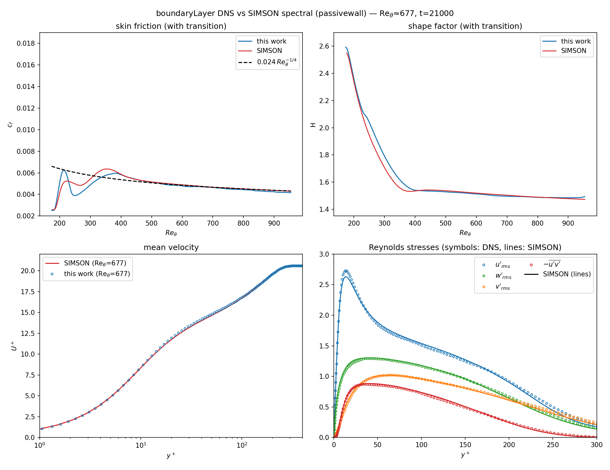

# Turbulent zero-pressure-gradient boundary layer (ZPG TBL)

A spatially-developing incompressible **ZPG turbulent boundary layer** DNS,
non-dimensionalised by the inlet displacement thickness (Re_δ*,0 = 450, U∞ = 1),
validated against the **SIMSON pseudo-spectral reference** (`passivewall.hdf5`,
Schmitt/KIT). This is the final, best-resolved configuration that emerged from an
extended trip/resolution/solver study — the full history is in
**[`tests_record.md`](tests_record.md)**.

## The case shipped here

| ingredient | value | why |
|---|---|---|
| grid | 4096 × 176 × 192 (138 M) | Δx⁺≈4 ≈ Δz⁺≈3.7, Δy⁺_wall≈0.2, Δy⁺_max≈4 (in δ₉₉) |
| x-grid | geometric, stretch 1.5 | Δx⁺ ~ uniform as u_τ falls downstream |
| y-grid | blayer (wall-clustered + freestream coarsening) | resolve the BL, keep the tall domain affordable |
| domain | 750 × 100 × 32 δ*₀ | ly = 100 δ*₀ (very tall) so the top pins a true ZPG |
| trip | Schlatter–Örlü, `trip_amp = 0.03` | gentle trip (matches the reference's development) |
| convection | skew-symmetric | energy-neutral under the incremental projection |
| **pressure solver** | **red-black SOR, niter = 6, sor = 1.5** | stable at low niter on this outlet case + ~1.8× faster than Chebyshev-Jacobi niter=12 |

## Result (converged, ~4000 t.u. of averaging)

At Re_θ = 677, vs the SIMSON spectral reference:

| quantity | this DNS | SIMSON | Δ |
|---|---|---|---|
| c_f | 0.00464 | 0.00471 | **−1.6 %** |
| H | 1.501 | 1.507 | **−0.4 %** |
| u′/v′/w′_rms peak | 2.69 / 1.02 / 1.31 | 2.63 / 1.02 / 1.30 | ~1–2 % |
| −u′v′ peak | 0.874 | 0.882 | −0.9 % |

Mean U⁺(y⁺) collapses onto the reference through the sublayer and log region; the
Reynolds stresses overlay the spectral profiles; the shape factor sits on the
reference. The residual ~1.6 % in c_f is the intrinsic 2nd-order-FD-vs-spectral
floor (see `tests_record.md` for the full decomposition of the original ~5 % gap
into tripping + streamwise resolution + this floor).



## Layout

```
README.md                 this file
tests_record.md           the full study: every case and what it showed
cold_start.ini            stage 0: cold start from the Blasius field (from scratch)
production.ini            stage 1 (re-equilibration at the production trip)
production_stats.ini      stage 2 (statistics accumulation)
production_stats.h5       the converged span+time statistics  [local, ~115 MB]
restart_field.h5          a developed field (IC + grid + snapshot)  [local, 4.4 GB]
reproduce.py              regenerate every figure from the above
assets/figures/           the PNGs (committed)
assets/postpro/           the post-processing scripts + reference data
    passivewall.hdf5      SIMSON spectral reference  [local, ~103 MB]
    tbl_uncontrolled.mat  earlier spectral reference (mean only)
    ref_schlatter_orlu_Re670.prof   KTH Re_θ=677 profile
```

Files marked *[local]* are too large for git (`restart_field.h5`,
`passivewall.hdf5` and `production_stats.h5` all exceed GitHub's 100 MB limit);
keep them in place to reproduce the figures.

## Reproduce

**Figures** (fast, from the shipped statistics):
```bash
python3 reproduce.py            # -> assets/figures/*.png
```

**The DNS from scratch** (multi-day GPU run — no data file needed). The developed
field that the un-committed `restart_field.h5` provided is regenerated by a cold
start, so the whole case reproduces from the three `.ini` files alone. Run from the
repository root with the paths adjusted, or copy the binary next to the case.

```bash
module load toolkits/nvhpc/25.9
BIN=./build_gpu/moby_solve      # 1 GPU; the run is ~138 M cells

# Stage 0 -- cold start: laminar Blasius field + trip 0.15 trips it into
# turbulence; run until the whole plate is turbulent and the transient has
# washed out (~2000 t.u. ~ 100k steps). Writes coldstart_<step>.h5.
mpirun -n 1 $BIN cold_start.ini

# Stage 1 -- re-equilibration at the production trip (0.03). Point [restart] at
# the last coldstart field, then run. Writes production_<step>.h5.
sed -i 's/^file = .*/file = coldstart_100000.h5/' production.ini   # [restart] section
mpirun -n 1 $BIN production.ini

# Stage 2 -- statistics. Point [restart] at the last stage-1 field, then run;
# accumulates ~4000 t.u. of span+time statistics into production_stats.h5.
sed -i 's/^file = .*/file = production_200000.h5/' production_stats.ini
mpirun -n 1 $BIN production_stats.ini

# Figures from the fresh statistics:
python3 reproduce.py             # needs assets/postpro/passivewall.hdf5 locally
```

Notes:
- The exact restart filenames (`coldstart_100000.h5`, `production_200000.h5`)
  depend on `nsteps` / `field_interval`; use whatever the final
  `coldstart_*` / `production_*` snapshot is actually called. The shipped inis
  ship pointing at the original run's names (`restart_field.h5`,
  `production_850000.h5`) — the `sed` lines above just repoint them.
- Why the cold start uses a *stronger* trip: `trip_amp = 0.15` is needed to trip
  the laminar inflow; the production `trip_amp = 0.03` (gentler, matching the
  reference's development) cannot, so it only runs on an already-turbulent field.
  This trip choice is the whole story of the shape-factor match — see
  `tests_record.md`.
- **Shortcut**: if you already have a developed field on this exact grid, skip
  Stage 0 and point `production.ini` `[restart]` straight at it.

Alternatively, the shipped inis run **as-is** from a saved `restart_field.h5`:
```bash
mpirun -n 1 ./build_gpu/moby_solve production.ini        # stage 1 from restart_field.h5
mpirun -n 1 ./build_gpu/moby_solve production_stats.ini  # stage 2 from the stage-1 end field
```
