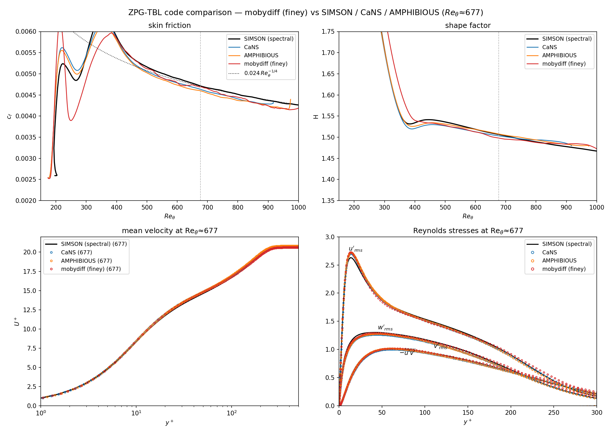

# Turbulent zero-pressure-gradient boundary layer (ZPG TBL)

A spatially-developing incompressible **ZPG turbulent boundary layer** DNS,
non-dimensionalised by the inlet displacement thickness (Re_δ*,0 = 450, U∞ = 1).
This is the shipped **"finey"** configuration — the best-resolved case from an
extended trip / resolution / solver study (full history in
**[`tests_record.md`](tests_record.md)**) — validated against three independent
reference DNS: the **SIMSON** pseudo-spectral code, **CaNS**, and **AMPHIBIOUS**.

## The case

| ingredient | value | why |
|---|---|---|
| grid | 4096 × 224 × 192 (176 M) | Δx⁺≈4 ≈ Δz⁺≈3.7, Δy⁺_wall≈0.23, Δy⁺_max≈4.3 (in δ₉₉) |
| x-grid | geometric, stretch 1.5 | Δx⁺ ~ uniform as u_τ falls downstream |
| y-grid | blayer (wall-clustered + freestream coarsening) | resolve the BL, keep the tall domain affordable |
| domain | 750 × 100 × 32 δ*₀ | ly = 100 δ*₀ (very tall) so the top pins a true ZPG |
| trip | Schlatter–Örlü, `trip_amp = 0.03` | gentle trip (matches the reference development) |
| convection | skew-symmetric | energy-neutral under the incremental projection |
| **pressure solver** | **red-black SOR, niter = 6, sor = 1.5** | stable at low niter on this outlet case, ~1.8× faster than Chebyshev-Jacobi niter=12 |

## Code comparison — SIMSON / CaNS / AMPHIBIOUS

All four codes share the nondimensionalization (Re_δ*,in = 450), so the developed
flow is compared directly at a matched **Re_θ ≈ 677**. The reference codes use the
strong Schlatter–Örlü trip; mobydiff uses the gentle trip, so transition sits at a
different Re_θ — the comparison is in the developed region where the trip is
forgotten.



| code | grid (nx·ny·nz) | c_f | H | u′_rms peak | −u′v′ peak |
|---|---|---|---|---|---|
| SIMSON (spectral) | 3072·301·— | 0.00471 | 1.507 | 2.631 | 0.882 |
| CaNS | 3200·384·135 | 0.00463 | 1.503 | 2.706 | 0.874 |
| AMPHIBIOUS | 3200·384·135 | 0.00460 | 1.508 | 2.723 | 0.899 |
| **mobydiff (finey)** | **4096·224·192** | **0.00469** | **1.498** | **2.727** | **0.871** |

Mean U⁺(y⁺) and the Reynolds stresses of all four codes overlay through the
sublayer, log region and wake. **Two takeaways:**

- **mobydiff's c_f is the closest of the finite-volume/difference codes to the
  spectral SIMSON** (−0.4 %, vs CaNS −1.7 %, AMPHIBIOUS −2.4 %).
- **The near-wall u′_rms peak sits ~3 % above SIMSON for _all three_ non-spectral
  codes** (mobydiff 2.73, CaNS 2.71, AMPHIBIOUS 2.72). This overshoot is therefore
  a generic second-order finite-volume/difference signature relative to a spectral
  method, **not** a mobydiff artifact — a trip-amplitude sweep (0.024 → 0.19)
  confirmed it is independent of the trip (`tests_record.md`).

The mobydiff comparison data, in the same NetCDF format as the reference files, is
committed at **`assets/mobydiff/xyz_4096_224_192/data.nc`**.

## Layout

```
production.ini            phase 1: re-equilibration (stats off)
production_stats.ini      phase 2: statistics accumulation -> production_stats.h5
cold_start.ini           stage 0: from-scratch laminar->turbulent (regenerates restart_field.h5)
reproduce.py             regenerate assets/mobydiff/*.nc + all figures from the statistics
tests_record.md          the full trip/resolution/solver study behind the shipped case
assets/
  mobydiff/xyz_4096_224_192/data.nc   our reduced statistics (committed, res-study format)
  figures/                            the committed comparison figures
  postpro/                            post-processing + grid/IC tooling (below)
```

Large data are **kept locally** (all exceed GitHub's 100 MB limit), listed in
`.gitignore` and regenerable — see below:

- `restart_field.h5` — a developed instantaneous field (the phase-1 IC),
- `production_stats.h5` — the raw span+time statistics,
- `assets/postpro/passivewall.hdf5` — the SIMSON spectral reference.

The **CaNS / AMPHIBIOUS** reference data live on the group LSDF share
(`.../tbl-dns/res_study/data_processed/{cans,amphibious}/*/data.nc`); the committed
mobydiff `data.nc` is in the identical format so the comparison is symmetric.

## Reproduce from scratch

No large input file is needed — the grid, the Blasius inflow and the trip forcing
are all generated by the solver from the `.ini`.

```bash
# build (see the repo README): ./compile.sh gpu   (or cpu)
MPI="mpirun -n 4 ./build_gpu/moby_solve"      # one rank per GPU

# stage 0 — cold start: laminar Blasius -> turbulent, ~2000 t.u. (~100k steps)
$MPI cold_start.ini
mv coldstart_100000.h5 restart_field.h5        # the developed field

# phase 1 — re-equilibrate on the shipped (grid, trip, solver), ~1000 t.u.
$MPI production.ini                            # -> production_100000.h5

# phase 2 — accumulate statistics, ~4000 t.u. -> production_stats.h5
$MPI production_stats.ini
```

Then regenerate the comparison data and figures:

```bash
python3 reproduce.py        # -> assets/mobydiff/.../data.nc + assets/figures/*.png
```

`reproduce.py` exports the statistics to the res-study NetCDF format
(`assets/postpro/make_mobydiff_nc.py`), draws the code comparison
(`compare_codes.py`, falling back to SIMSON-only if the LSDF reference data are not
mounted) and the SIMSON single-code figures. To continue the run instead, restart
`production_stats.ini` from a later `production_p2_*.h5` — the statistics
accumulators continue seamlessly.

### Post-processing tooling (`assets/postpro/`)

| script | purpose |
|---|---|
| `make_mobydiff_nc.py` | export `bl_stats.h5` → res-study NetCDF (`data.nc`) |
| `compare_codes.py` | mobydiff vs SIMSON / CaNS / AMPHIBIOUS (the figure above) |
| `compare_passivewall.py` | mobydiff vs SIMSON (single-code, 4-panel) |
| `bl_stats.py` | boundary-layer profile plots from the statistics |
| `make_finey_grid.py` | build the blayer wall-normal node line (ny=224) |
| `make_finewall_restart.py` | interpolate a field onto a finer y-grid |
| `dpdx.py`, `vonkarman.py`, `resolution.py`, `dyplus_profiles.py`, `viz_flowfield.py` | diagnostics |
