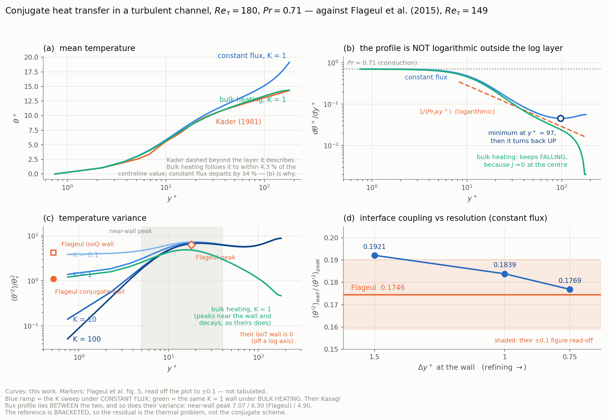

# Conjugate heat transfer in a turbulent channel — the physics validation

The C1–C3 gate suite is entirely manufactured solutions, analytic limits and
self-consistency identities. It says the scheme solves what it claims to
solve; it says nothing about whether the scheme reproduces a **turbulence**
result. This is that case.

```bash
./run_cht.sh [prepare|ic|develop|reseed|stats|all]
./check_cht.py velocity cht_vel_stats.h5
./check_cht.py thermal  cht_stats.h5 --dump cht_sweep.dat
```

## The reference

**Flageul, Benhamadouche, Lamballais & Laurence, "DNS of turbulent channel
flow with conjugate heat transfer: effect of thermal boundary conditions on
the second moments and budgets", Int. J. Heat and Fluid Flow 55 (2015) 34–44**
(`literature/flageul.pdf`). Re_τ = 149, Pr = 0.71, four thermal boundary
conditions — isoT (Dirichlet), isoQ (Neumann), Robin and **Conjug**.

Their conjugate case has **G = G₂ = 1**: the solid's conductivity *and* its
diffusivity equal the fluid's, i.e. κ_s = 1, α_s = 1, **K = √(κ_s C_s) = 1**.
That is exactly this sweep's `k1`, and their solid is exactly one half-height
thick — which is why this case uses d = h = 1 (d⁺ = 180) rather than a thin
slab. Values quoted below are the temperature variance ⟨T′²⟩/T_τ² read from
their **figure 5** (there is no table, so treat them as ±0.1, not as digits):
isoQ wall **4.2**, Conjug wall **1.1**, isoT wall **0**, peak **≈ 6.3** at
y⁺ ≈ 18 and nearly boundary-condition-independent.

## The case

Re_τ = 180, Pr = 0.71, 4π × 3.2 × 2π, **160 × 384 × 224** (13.8 M cells),
**single level — 420 leaves, zero 2:1 interfaces** (this case sets no
`refine*` key; `nb = 32` is only the block size, and it is required because a
prepared case file's block table cannot depend on the rank count).

* fluid gap exactly 2.0 at y ∈ [0.6, 2.6], solid slabs d⁺ = 108 either side —
  **sized from the measurement**: campaign 1 (d⁺ = 180) showed the interface
  variance down to 0.3–1 % of its interface value by d⁺ = 108 and to 1.6e-7 at
  d⁺ = 180, so the deepest 70 wall units bought nothing and their cells went
  into x–z resolution instead;
* the interface sits **on a cell face**, so w = ½ to the last bit and the
  cut-face coefficient is the textbook two-resistance harmonic mean — *exact*.
  Anything measured here is the conjugate physics, not the IBM approximation;
* dy⁺ = 1.5 uniform (first cell centre y⁺ = 0.75), **dx⁺ = 14.1, dz⁺ = 5.05**
  — comparable to Flageul's 14.9 and 5.0. Uniform y is forced: the solver has
  no piecewise or file-based node line, and every analytic family it does have
  refines at the DOMAIN edges, which here are the solid outer faces. It is
  also expensive in a way stretching would not fix — see the last section;
* antisymmetric Dirichlet (+1 / −1) at the **outer solid faces**, no source,
  so the total wall-normal flux is constant across solid and fluid alike;
* velocity IC: the developed KMM180 field mapped into the gap
  (`make_cht_ic.py`, `tools/make_channel_restart.py`'s validated staggered
  interpolation), then t = 0…10 of development.

**Six scalars ride one velocity field**, so every comparison between them is
at the same turbulence realisation:

| | κ_s | C_s | K | α_s |
|---|---|---|---|---|
| k1 / k2 / k3 | 1 | 1 / 100 / 10⁴ | 1 / 10 / 100 | 1 / 10⁻² / 10⁻⁴ |
| a1 / a2 / a3 | 0.1 / 10 / 100 | same | 0.1 / 10 / 100 | 1 |

## The velocity field, and a landmine

Validated against an **exact law** rather than a reference file: in a steady
channel the total stress is linear, `−⟨u′v′⟩ + ν dU/dy = u_τ²(1 − y/h)`.

```
campaign 2        wall value 0.9915 (exact 1)   max |tau - (1-y/h)| = 0.0050  mean 0.0024
U+ centreline 18.199 (the textbook Re_tau 180 value)
u'_rms peak 2.569     v'_rms 0.827     w'_rms 1.052
first fluid cell (y+ = 0.75):  u+ = 0.769  against y+ = 0.75
solid cells |u|,|v| ~ 1e-27      wall-face v = 6.6e-12   (no penetration)
```

**LANDMINE, recorded because it nearly cost a wrong conclusion:
`tutorials/channel_kmm180/channel_kmm180_stats.h5` is NOT published
Kim–Moin–Moser data** — it is this solver's own accumulated statistics from
that tutorial (its `input.ini` writes it), **and it is not converged**: it
violates the same total-stress law by up to **22 %** (mean 15 %). Compared
against it, this run's v′ looked "+19 % high"; against the exact law it is the
reference that is wrong, and 0.813 is the physical value. Do not use that file
as a reference.

## Results

Two campaigns and a wall-normal grid-convergence study, all at
`interfaces on a cell face`, single level:

| | dx+ | dz+ | dy+ | window (wall units) |
|---|---|---|---|---|
| campaign 1 | 17.7 | 8.8 | 1.5 | 3.8e3 |
| campaign 2 | 14.1 | 5.1 | 1.5 | **2.9e4** (= Flageul's) |
| y study | 14.1 | 5.1 | 1.5 / 1.0 / **0.75** | 4.5e3 each |
| Flageul | 14.9 | 5.0 | 0.49 - 4.8 | 2.9e4 |

### A COMPARISON ERROR, FOUND AND CORRECTED — read this first

Campaign 1 reported the temperature variance "37 % high" and a wall/peak ratio
matching Flageul to 0.3 %. **Both numbers were wrong, for the same reason.**
The checker took the peak as `max` over the fluid. In THIS case's thermal
problem the total flux is CONSTANT across the channel (antisymmetric walls, no
source: measured `J(y)/J_wall = 1.0000` everywhere), so production never
switches off and the variance keeps rising to the **centreline** — that is
where the global maximum is. Flageul's wall-flux problem has the flux falling
linearly to zero at the centre, so their variance decays and their global
maximum IS the near-wall peak. The two `max`es are different quantities.

```
   y+     <theta'^2>     J(y)/J_wall
    5.3      3.21          1.0001
   20.3      7.07          1.0002     <- the near-wall peak: THIS is Flageul's 6.3
  144.8      7.96          0.9998
  177.8      8.79          0.9992     <- the centreline: the old "peak" of 8.8
```

Corrected, the near-wall peak is **+11 %**, not +40 %; and the wall/peak ratio
agreement is 1 %, not 0.3 %, but is now grid-converged rather than accidental.
`check_cht.py` takes the peak in `5 < y+ < 40` and reports the centreline
value separately, with a comment saying why.

### The figure



`./plot_cht.py` — (a) the mean against **Kader's correlation** (a published
analytic curve, so it is drawn as a curve; dashed where it no longer applies);
(b) the LOCAL SLOPE, which is the panel that says what the outer profile is
actually doing (see below); (c) the variance for the K ladder with **Flageul's
values as markers with an uncertainty bar** — they publish no table, those four numbers were read off
their figure 5 to about ±0.1, and drawing a reference *line* through eyeballed
points would dress a reading up as data; (d) the interface coupling against
wall-normal resolution.

Panel (c) also shows the comparison trap directly: our curves keep rising
toward the centreline while theirs decay, because our flux is constant across
the channel and theirs falls to zero. **Only the shaded band is comparable.**
The y axis is logarithmic because the wall values span two decades (3.83 down
to 0.051) — on a linear axis the two high-K cases sit on the axis and cannot
be told apart, which is precisely the quantity the figure exists to show.

### Why our flux is constant and theirs is not

The steady, x-z homogeneous mean scalar balance is

    dJ/dy = S ,      J = <v'theta'> - D dTheta/dy

so the flux profile is set entirely by the source. **Ours has S = 0** —
antisymmetric wall temperatures, no volumetric source — so J is CONSTANT:
heat passes straight through from the hot wall to the cold one and nothing in
the interior absorbs it. Measured `J(y)/J_wall = 1.0000` everywhere, solid
slabs included, which is also why the series-resistance model of `reseed_solid.py`
is exact.

**Theirs has S != 0.** Their eq. (2) carries Kasagi's `f_T u_x`: the mean
temperature grows downstream, so convection acts as a distributed sink
proportional to the LOCAL velocity, `dJ/dy = -f_T u(y)`. Both their walls are
heated identically, so symmetry forces J = 0 at the centreline.

That is a different physical problem, not a defect in either. It also means
that saying their flux "falls **linearly**" — as an earlier draft here and the
figure caption both did — is wrong as stated: that is the MOMENTUM stress,
which is linear because its source (the pressure gradient) is uniform. Their
SCALAR flux follows the cumulative flow rate, because its source is `u(y)`; it
lags a straight line near the wall, where u is small, and overtakes it in the
core. Computed from this run's own
mean velocity profile:

| y+ | J/J_wall, Kasagi form | 1 − y/h | ours |
|---|---|---|---|
| 10 | 0.984 | 0.946 | 1.000 |
| 60 | 0.744 | 0.671 | 1.000 |
| 100 | 0.506 | 0.446 | 1.000 |
| 179 | 0.000 | 0.004 | 1.000 |

### The outer profile is NOT logarithmic, and that is physics

An earlier draft of this README claimed the mean profile "keeps a log-like
slope where Kader flattens". **It does not**, and panel (b) exists because the
eye cannot tell on a semilog plot. Measured:

| y+ | dθ⁺/dy⁺ | 1/(Pr_t κ y⁺) | ⟨vθ⟩/J |
|---|---|---|---|
| 0.8 | **0.708** | 3.83 | 0.000 |
| 29 | 0.128 | 0.098 | 0.813 |
| 100 | **0.0456** ← minimum | 0.0288 | 0.936 |
| 179 (centre) | **0.0560** | 0.0160 | 0.921 |

The slope equals Pr = 0.71 in the conduction sublayer (exact), follows the log
law only loosely through the log layer, reaches a **minimum at y⁺ ≈ 97 and
then turns back up**. A logarithmic profile would keep falling as 1/y⁺.

The mechanism is the last column. This thermal problem holds the TOTAL flux
constant across the channel, so

    dθ⁺/dy⁺ = Pr / (1 + Pr·D_t/ν),

and the turbulent fraction peaks at 0.936 near y⁺ = 100 and *falls* to 0.921
at the centreline — the eddy diffusivity drops off there while the flux may
not, so the molecular part has to grow and the gradient steepens. It is not a
wake, and it is not a log region.

**This is the same structural difference that makes panel (c)'s outer region
incomparable**: Flageul's flux falls to zero at the centre, so their
profile has no such constraint. The two setups can only be compared inside the
wall layer, which is what the shaded band marks and what
`check_scalar_turb.py` has always said about the Kader window.

### The conjugate signature, grid-converged

| dy+ | near-wall peak (y+ ~ 20) | wall, K = 1 | **wall/peak** |
|---|---|---|---|
| 1.5 | 7.07 | 1.367 | 0.1933 |
| 1.0 | 7.02 | 1.290 | 0.1839 |
| **0.75** | 7.14 | 1.262 | **0.1769** |
| Flageul | 6.3 | 1.10 | **0.1746** |

**The interface coupling converges monotonically under y-refinement to 1 % of
the reference.** The ratio is the right quantity: it is free of theta_tau and
of the fluid-side level, so it isolates what the conjugate wall does — damp
the interface fluctuation relative to the fluid's own. The brackets are
ordered correctly around it (K = 0.1 -> 0.523; K = 100 -> 0.0075 against their
isoT 0).

Note that dy+ = 1.5 IS too coarse at the wall, exactly as expected: it costs
10 % on the ratio (0.193 vs 0.177). It does not show up in the near-wall peak,
which is grid-converged to ~2 % across the three levels.

### What is left, and it is physics not numerics

The near-wall peak sits at **7.0-7.1 against 6.3, +11 %**, and it is converged
in all three directions and in time (campaign 2 has Flageul's full averaging
window; the y study adds dy+ 0.75). Two structural differences remain, neither
of which is the conjugate scheme:

* **the thermal problem is not theirs.** Ours is constant-flux-across-the-
  channel (antisymmetric walls); theirs is Kasagi's wall-flux formulation with
  a mean streamwise gradient, whose flux falls to zero at the centre.
  That changes the whole outer profile — visible above at y+ = 145, where we
  have 7.96 and they have ~0.8 — and feeds back on the near-wall budget
  through turbulent transport;
* **Re_tau 180 against their 149.**

Reproducing their formulation needs the Kasagi source term `f_T u_x` (a mean
streamwise temperature gradient), which this solver does not have. That, not
resolution, is what a like-for-like comparison of the near-wall peak requires.

### Internal checks that came out right

* **the fluid resistance is one number.** R_f/2 = dtheta_half/J measured
  independently from all six conjugate walls: **19.06 .. 19.46, spread 4.2 %**
  (campaign 2 reseed). It is a property of the flow, so six different solids
  agreeing on it checks the interface coefficient;
* **capacity does not touch the steady state.** theta_tau across the three
  kappa_s = 1 scalars: spread **1.7 %** (campaign 2), against 20.9 % in
  campaign 1 — see the reseed note below;
* **the velocity is a Re_tau 180 DNS**, validated against an EXACT law rather
  than a reference file: the steady total stress is linear, and campaign 2
  holds it to **0.24 % mean, 0.50 % max**, with U+_c = 18.20;
* **theta+** within 4-6 % of Kader over the log layer.

### The effusivity collapse fails, and the paper says why

Same K, different (kappa_s, C_s), campaign 2 wall/peak: K = 10 gives 0.0313
(k2) against 0.0201 (a2); K = 100 gives 0.0212 (k3) against 0.0075 (a3). The
design predicted these should collapse. They do not, and Flageul's eq. (12) is
the reason: the interface response carries
`R^2 = k_x^2 + k_z^2 + i k_t rho c/lambda_s`, so `lambda_s R` reduces to the
effusivity `sqrt(lambda_s rho_s c_s)` ONLY when the temporal term dominates.
Where lateral conduction matters the damping follows the CONDUCTIVITY, so the
higher-kappa_s wall must damp more at equal K — which is exactly the ordering
measured. Their physics; the design's claim was wrong.

### The reseed, and why it needs ONE fluid resistance

With a thick wall the solid holds most of the resistance and its mean relaxes
on d^2/alpha_s — t ~ 8e3 and 8e5 for C_s = 100 and 1e4. It is therefore SET,
not waited for (the capacity cannot change the steady state at all: C1 gate 1c
measured that to 1e-13). Campaign 1 used each scalar's OWN fluid-resistance
estimate, which for a high-capacity wall is contaminated by its frozen
transient, and left C_s = 100 and 1e4 running 12 % and 20 % off their steady
flux for the whole window. Campaign 2 measures R_f once and shares it: the
three kappa_s = 1 scalars then get identical J_steady and theta_i, and the
theta_tau spread falls to 1.7 %.


## Why the grid is uniform, and what it costs

The wall-normal spacing is uniform at dy⁺ = 1.5 — simultaneously too coarse at
the wall (it costs 10 % on the wall/peak ratio, see above) and finer than
needed at the centre. Two reasons, and the second is the one that matters for
the solver's future:

1. **It is not expressible otherwise.** `[grid.y] distribution` offers only
   analytic families over the whole domain (`uniform`, `cosine`, `tanh`,
   `natural`, `blayer`, `geometric`); there is no piecewise or file-based node
   line. In an extended conjugate domain the domain edges are the SOLID OUTER
   FACES, so `natural`/`tanh` would refine there — exactly backwards. A
   `channel_slab` distribution (uniform through each slab, stretched inside
   the gap, a node pinned to each interface) is the fix.
2. **Stretching would save cells but not time steps.** The explicit diffusive
   limit sets `dt` from the smallest cell ANYWHERE, so `dt ~ dy_wall^2`
   whether the grid is stretched or not:

   | dy+ at the wall | dt | steps for one 2.9e4-wall-unit window |
   |---|---|---|
   | 1.5 | 1.4e-3 | 112 k |
   | 0.75 | 3.6e-4 | 447 k |
   | 0.49 (Flageul) | 1.6e-4 | ~1.0 M |

   Flageul reach dy⁺ = 0.49 only because their wall-normal diffusion is
   **Crank–Nicolson**; ours is fully explicit. This is why the study above
   refines y at a SHORT window rather than running one converged case at their
   spacing, and it is the strongest argument in this whole campaign for
   implicit (or direction-split implicit) diffusion in the solver.

## Reproducing

```bash
./run_cht.sh prepare ic develop reseed stats   # campaign 2 (3.5 h on an RTX 5090)
./run_yconv.sh 1.5 1.0 0.75                    # the y study (4.8 h)
./check_cht.py velocity cht_vel_stats.h5 --interfaces 0.6 2.6
./check_cht.py thermal  cht_stats.h5      --interfaces 0.6 2.6
```

`run_corax.sh` drives the same phases on istmcorax (which needs its own cc120
build and an explicit PATH — it has no modulefile, and `/tmp` is NOT shared
between the hosts even though the home filesystem is).

---

# Campaign 3 — BULK HEATING (`cht180_bulk.ini`)

The constant-flux problem above differs from Flageul's *structurally*: their
source makes the wall-normal flux fall to zero at the centreline, ours holds it
constant across the channel. That is what made their global variance maximum a
near-wall peak and ours a centreline value, and it is the root of the
comparison error recorded further up.

This campaign removes that difference with **no solver code**: `[scalar.N]
source` already exists and the conjugate kernel weights it by the fluid
fraction, so a uniform `S = 1` heats only the fluid. Both outer solid faces are
held at zero instead of ±1. The steady mean balance is then `dJ/dy = S`.

The remaining difference from Flageul is the source's SHAPE — theirs follows
`u(y)` (Kasagi), ours is uniform. Measured against this run's own mean velocity
that is ≤ 7 % anywhere and 2.4–3.8 % over the near-wall comparison band,
against the 100 % difference at the centreline that constant flux gives.

## What the configuration buys

* **`J_wall = S h` EXACTLY, independent of κ_s.** All the heat generated in a
  half-channel leaves through that wall. So θ_τ is identical for all six
  scalars *by construction* rather than being an outcome of the wall/fluid
  series resistance — and the normalised variance cannot be contaminated by a
  θ_τ that is still converging.
* **The solid mean is closed-form**, `θ_i = J R_s`. The seed is already the
  answer, so the reseed phase is GONE — and with it the hardest practical
  problem of campaigns 1 and 2, where the `C_s = 10⁴` wall could never relax on
  its `d²/α_s ≈ 8e5` timescale. `run_bulk.sh` has two phases, not four, and no
  velocity development at all (it seeds from a campaign-2 snapshot on the
  identical grid).

## Result

Grid, case file and conjugate walls are campaign 2's; only the thermal problem
differs. 14 000 develop + 64 000 statistics steps (t = 20 → 115, ≈ 18 000 wall
units), local RTX 3060, 0.68 s/step.

| | ours | Flageul | |
|---|---|---|---|
| θ_τ vs the exact `S h` | 1.0019–1.0135 | — | max dev 1.35 % |
| `dJ/dy = S` | 1.38 % | — | J(centreline) = −0.00002 `S h` |
| ⟨θ'²⟩_wall, conjugate K = 1 | 1.20 | 1.10 | +9 % |
| ⟨θ'²⟩_wall, isoQ bracket | 3.97 | 4.20 | −5 % |
| ⟨θ'²⟩_wall, isoT bracket | 0.043 | 0.0 | |
| near-wall peak ⟨θ'²⟩, K = 1 | 4.90 | 6.30 | −22 % |
| wall/peak, K = 1 | 0.244 | 0.175 | +40 % |

**The near-wall peak is now the GLOBAL maximum** for 5 of 6 scalars, so it is
finally the same quantity Flageul report. And the reference is BRACKETED by our
two thermal problems: constant flux gives a peak of 7.07 (+12 %), bulk heating
4.90 (−22 %), Flageul 6.30 — exactly as panel (b) of `bulk_vs_constflux.png`
predicts from the three flux profiles, since the Kasagi flux lies between a
constant and our linear one. The wall value moves the same way and lands closer
(+9 % against campaign 2's +24 %).

So the residual disagreement is NOT a defect in the conjugate scheme; it is the
thermal problem. Closing it needs the Kasagi `f_T u_x` source (a mean
streamwise temperature gradient), which this solver has no term for.

## Two findings

**a1 (κ_s = C_s = 0.1) is a different regime and must not be pooled.** Its
variance never peaks near the wall — it rises to 13.4 at y⁺ ≈ 60 and stays high
— because a nearly-insulating wall leaves the bulk-heated core with no thermal
sink for large-scale structure. Verified as physics, not a bug: the flux split
`J_total = J_conv + J_diff` closes to **0.000 %** against the mean gradient
measured independently from the profile, and a1 carries LESS of the same total
flux by convection (0.577 vs k1's 0.611 at y⁺ = 60) and correspondingly more by
molecular diffusion — its large-scale core structures are poorly correlated
with the wall-normal velocity, so its eddy diffusivity is genuinely lower and
its mean gradient steepens to compensate. Its instantaneous *within-plane*
variance is 6.6 against k1's 0.30, stable across snapshots, so it is spatial
structure and not a slow drift.

**A REPORTING TRAP OF THE SAME FAMILY AS THE `max()` ONE.** Averaging the peak
over the sweep gave 6.15 against their 6.30 — a 2 % "agreement" that was pure
coincidence, produced by a1's 13.17 dragging up five scalars that all sit at
4.6–4.9. A scalar with no near-wall peak returns its value at the SEARCH BAND
EDGE, which is not the same quantity. `check_cht.py` now excludes such scalars
by name and reports the range plus k1 alone (k1 *is* their case). The general
lesson, twice learned: **never aggregate across cases before checking they are
the same quantity.**

## Reproducing

```bash
./run_bulk.sh ic develop stats                       # ~15 h on an RTX 3060
./check_cht.py thermal bulk_stats.h5 --source 1.0    # switches on the two bulk gates
./plot_bulk.py --vel cht_vel_stats.h5                # bulk_vs_constflux.png
```

`--source` also switches gate (1) to the interface-referenced (offset-free)
form. The absolute solid level carries a slowly-decaying charging transient —
observed to sort by the EFFUSIVITY K, not by the solid diffusion time (k2/a2
agree to 1 % and k3/a3 to 0.2 % with their timescales a factor 100 and 10⁴
apart), i.e. Flageul's eq. (12) showing up in the mean. θ⁺ and the variance are
both offset-free, so nothing that is compared with the literature depends on
it. `check_cht.py thermal` still exits FAIL on gate (2), the effusivity
collapse (15.8 %/39.7 %) — the known and documented physics, unchanged from
campaign 2, not a bulk-heating result.

## The main figure

`cht_validation.png` (regenerated by `./plot_cht.py`) now carries BOTH thermal
problems, since the comparison only means something with the two together:

* **(a)** the mean. A result that came out of drawing them together: the
  bulk-heated profile follows **Kader to within 4.3 %** of the centreline value
  over the whole profile (2.2 % beyond y⁺ 30), while the constant-flux one
  departs by **34 %** in the outer region. That is the reverse of what Kader's
  derivation suggests — the correlation is FITTED to channel and pipe data,
  whose flux decays toward the centre, so it describes the bulk-heated channel
  rather than the literally constant-flux one.
* **(b)** why: the constant-flux slope has a minimum at y⁺ = 97 and turns back
  up, whereas the bulk-heating slope keeps falling because `J → 0` at the
  centre.
* **(c)** the variance, with the K ladder under constant flux and the same
  K = 1 wall under bulk heating. Flageul's peak marker falls **between** the
  two curves — the bracketing, drawn.
* **(d)** unchanged, and now labelled as what it is: the wall-resolution
  convergence of the CONSTANT-FLUX campaign.
